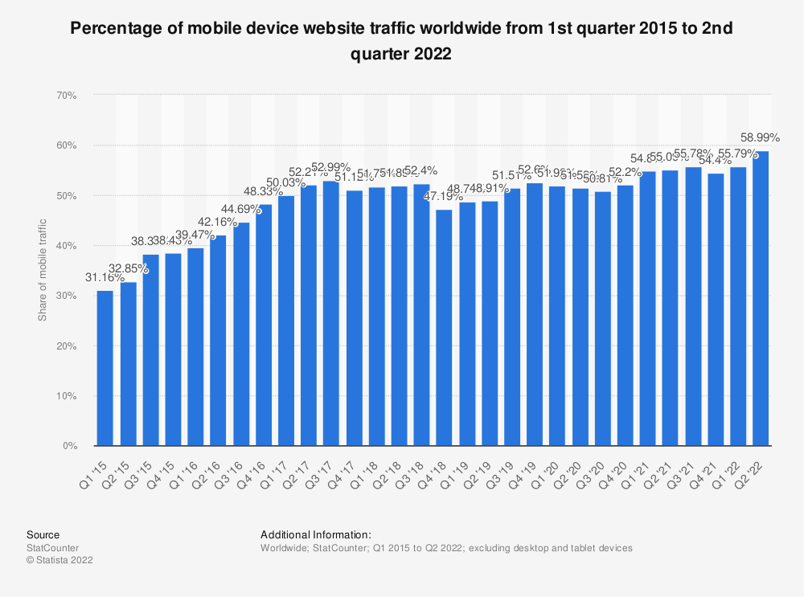
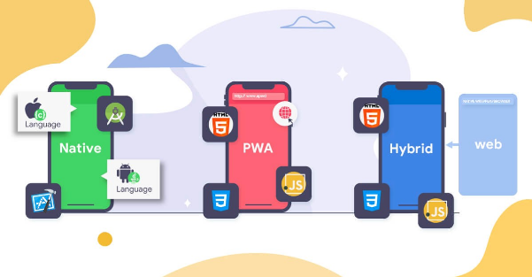
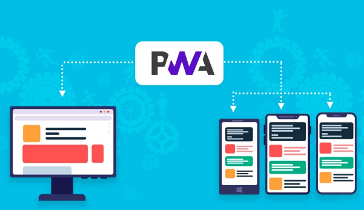
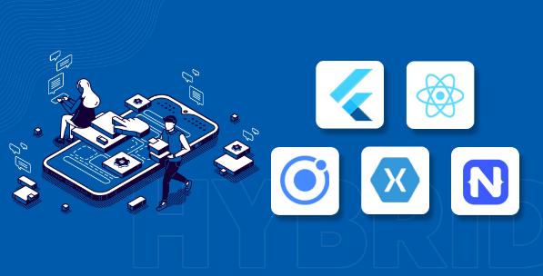
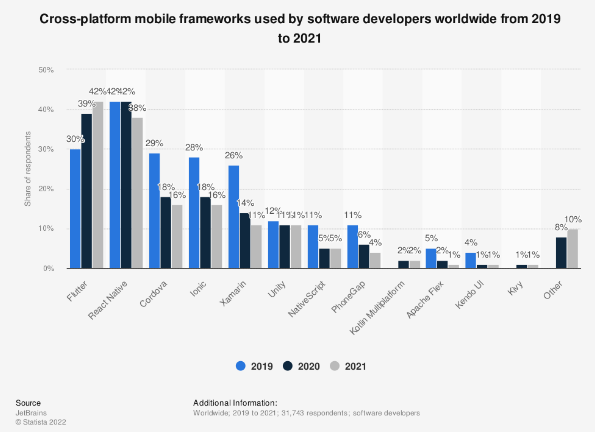

# Desarrollo de apps multi-plataforma vs nativas

El desarrollo de aplicaciones móviles se ha vuelto un boom con el pasar de los años, para nadie es un secreto que el mayor tráfico de usuarios viene dese los dispositivos móviles, esto dada la facilidad que tienen y su rapidez, y aquí entran muchos actores a jugar un papel muy interesante.

Desde los inicios de la web, cuando teníamos todo en un solo lugar, y hasta tiempo después, cuando logramos una separación de roles (como lo es ahora frontend y backend), hemos llegado a un punto en donde del lado del frontend tenemos que pensar en un nicho que cada día toma más fuerza, los usuarios que van a utilizar nuestra aplicación desde su celular (alrededor del 58.99% de usuarios utilizarán nuestra app desde dispositivos móviles).

## ¿Qué se está haciendo para atender a estos usuarios?

Cuando este problema se hizo evidente no se contaba con muchas opciones para el desarrollo de aplicaciones que pudieran ser usadas desde dispositivos móviles, en su mayoría la única opción era el desarrollo de aplicaciones nativas, lo cual les adelanto, tiene un rendimiento superior, pero resulta difícil y costoso conseguir talento que pueda sumarse a estos proyectos. Es por esto que surgieron alternativas que buscan lograr soluciones parciales a las necesidades del proyecto, dado que ninguna solución es mejor o peor, todo es adaptable a las etapas del proyecto y a las necesidades específicas del mismo.

### PWA's :

El desarrollo web es una de las áreas más grandes en el mundo de la programación, esto ha permitido que se desarrollen muchas estrategias para atacar este problema. Para el año 2015 empezó a hablarse de un término que fue tomando cada vez más fuerza, las PWA's por sus siglas en inglés progressive web apps. Las PWA's son aplicaciones que corren a través del navegador y están pensadas para que sean utilizadas principalmente desde dispositivos móviles sin consumir muchos recursos, veamos algunas de las principales ventajas que presentan las PWA's:

- No requiere de una instalación dado que corre en el navegador
- Pueden ser utilizadas en cualquier sistema operativo que tenga un navegador moderno (Safari, Google, Edge ...)
- Tienen la ventaja de que con un solo código pueden apuntar a múltiples sistemas, lo que reduce el costo y tiempo de desarrollo
- Posicionamiento en web, pueden ser optimizadas de manera más sencilla para los distintos buscadores
- Según como esté pensada la PWA en algunos casos se pueden manejar supuestos para cuando haya una desconexión de la red, lo que conocemos como Network independence
- Diseño responsivo, el desarrollo de las PWA se logra mediante tecnologías como media queries y viewports lo que permite un manejo más acertado para las distintas pantallas que puede tener el usuario (Desktop, tablet, mobile o cualquier otro)
- Las PWA's modernas cuentan con opciones que permiten, desde tu propio navegador, generar accesos directos desde tu dispositivo móvil, dando la apariencia de tener una app instalada, lo que mejora considerablemente la experiencia de usuario y el acceso a la misma aplicación

Las PWA’s son sin lugar a duda una alternativa muy buena para proyectos que requieran este tipo de cross-platform, en donde el alcance de usuarios abarca tanto la web como dispositivos móviles, sin la necesidad de acceder a recursos muy específicos.

¡Aquí hay algunos ejemplos de empresas que actualmente cuentan con una PWA!

- Starbucks
- BMW
- Pinterest
- Spotify

## Native apps :

En la actualidad contamos con una gama muy extendida de dispositivos móviles, y estos a su vez cuentan internamente con sistemas operativos, algunos dominan sobre otros en el mercado por sus características particulares. Cada sistema operativo tiene funcionalidades propias que se adaptan a los diferentes dispositivos (hardware) y brindan a los usuarios diferentes experiencias a nivel visual y funcional. 

Si bien existen distintos sistemas operativos para dispositivos móviles, aquí hablaremos de los que dominan el mercado. Nos referimos a Android y iOS, que son los líderes en la actualidad, por lo que gran parte del desarrollo móvil nativo se enfoca en estos dos sistemas operativos.

Una de las principales cualidades que tiene el desarrollo nativo es un gran rendimiento sobre cualquier otro tipo de desarrollo, esto se debe a que su compilación se hace en el código fuente del sistema operativo, lo cual brinda un escalón más alto en rendimiento. Además, todas las APIs nativas están presentes, por lo que se puede acceder a todos los recursos del sistema.

El desarrollo de aplicaciones nativas ha ido evolucionando. En iOS se codificaba en Objective-C, pero hoy se utiliza Swift, un lenguaje de programación un poco más intuitivo y con una curva de aprendizaje menos pronunciada. Algo similar ocurre en Android, en donde inicialmente se trabajaba en Java, pero hoy se usa principalmente Kotlin. Si bien se aconseja trabajar con los lenguajes modernos, se requiere conocimiento en los antiguos, ya que en muchos casos  son necesarios para la creación de módulos muy específicos, que permitan alcanzar altos niveles de rendimiento.

### ¿Por qué hacer desarrollo nativo?

- Personalización avanzada
- Mayor seguridad
- Escalabilidad
- Mejor rendimiento
- Facilidad de liberar en tienda
- Reducción de bugs / Manejo de errores
- Mejora en la UX

La mayoría de las empresas que cuentan con una app llegan a un punto en donde requieren hacer este tipo de migración al desarrollo nativo, es por esto que posiblemente cualquiera de las empresas top mundial que tengas en mente ya cuenten con una app nativa, algunos ejemplos de empresas con apps nativas son:

- WhatsApp
- Pokemon GO
- Waze
- Tesla
- Spotify

## Hybrid mobile app development:

Uno de los principales inconvenientes que tiene el desarrollo nativo es la dificultad de encontrar talento especializado en estos lenguajes, lo que hace que conseguir un grupo de desarrollo con estas habilidades resulte una tarea difícil, que acarrea un gran costo dada la baja oferta de desarrolladores. Además de esto, si ya resulta complejo conseguir un equipo de trabajo para el desarrollo de una app en un sistema operativo específico, será más difícil y costoso hacerlo para dos.

Las PWA's son bastante útiles, pero como ya hemos visto, llega un punto en donde estas se quedan cortas a nivel de acceso de los recursos propios del dispositivo, lo que limita la aplicación. En este punto ya entendemos que el desarrollo nativo es el ganador a nivel de rendimiento, pero también es el desarrollo más costoso y demorado.

Por estas razones han ido saliendo nuevas iniciativas, para proveer a la comunidad con herramientas y tecnologías que permitan el desarrollo multiplataforma (independientemente del sistema operativo). En el mundo del desarrollo multiplataforma exciten alternativas como React Native, creada por Facebook, la cual ha sido una de las tecnologías con mayor adopción, dado que todo aquel que use React js en la web, puede migrar a un proyecto en React Native sin mayores dificultades. También tenemos el caso de Flutter, creada por Google, que cuenta con una sintaxis muy amigable y un buen rendimiento.

Las aplicaciones que son construidas con tecnologías multiplataformas son increíbles, ya que nos permiten el acceso a recursos propios del dispositivo y ofrecen un rendimiento aceptable. Cada día nacen más y más proyectos creados desde un inicio con tecnologías de este tipo, muchas veces los proyectos en su fase inicial se crean con estas herramientas, pero cuando alcanzan un nivel de madurez suficientemente, y la demanda de la aplicación requiere mayores niveles de rendimiento, se suelen hacer migraciones a tecnologías nativas; aun así, en la mayoría de los casos el desarrollo híbrido presenta mayores ventajas para los equipos de desarrollo.

Actualmente muchas empresas estan apostando por este tipo de desarrolo, algunas de estas son:

- Microsoft teams
- Discord
- Evernote
- Uber
- JustWatch

El desarrollo híbrido sin ninguna duda está en crecimiento y muchos proyectos se suman a estas tecnologías. En una encuesta de Statista del 2021 se encontró que Flutter y React Native son las tecnologías que más se utilizan en el desarrollo de aplicaciones móviles multiplataforma. Aun así, se empieza a ver que muchas otras propuestas se suman al ecosistema.

## Conclusiones

No podemos sugerir una de las tres opciones como la única y mejor sobre las demás, porque cada una de estas tiene aplicaciones distintas según lo que demande cada proyecto. La comunidad cada vez más tiende al desarrollo de aplicaciones híbridas, esto pensando siempre en que las aplicaciones puedan escalar más fácil que las PWA's y el desarrollo es menos costoso que crear de forma separada para dos sistemas operativos distintos.  Las PWA's son una muy buena opción cuando se conoce bien que se requiere de antemano y se observa que la PWA puede suplir todos los requerimientos del proyecto. Por último, si el proyecto demanda mucho rendimiento, acceder a recursos muy específicos del dispositivo, o simplemente se requiere programar para un sistema operativo específico, entonces la opción nativa es la mejor opción. 

En esta tabla se resumen las comparaciones entre estas formas de desarrollo:

|               Parámetros                |         Hybrid         |         Native         |     PWA      |
| :-------------------------------------: | :--------------------: | :--------------------: | :----------: |
|           Codigo reutilizable           |          Alto          |          Bajo          |   Muy alto   |
|       Componentes pre-estilizados       |          Alto          |          Medio         |     Alto     |
|          Third-party-libraries          |          Alto          |          Alto          |     Alto     |
|               Popularidad               |          Alta          |          Medio         |     Alta     |
|               Performance               |          Medio         |          Alto          |     Medio    |
| Funcionalidades nativas del dispositivo |          Medio         |          Alto          |     Bajo     |
|              Distribución               | Tienda del dispositivo | Tienda del dispositivo |     URL      |
|           Tiempo de desarrollo          |          Medio         |          Alto          |     Bajo     |
|                 Soporte                 |          Limitado      |          Alto          |   Limitado   |
|                 Costos                  |          Medio         |          Alto          |     Bajo     |

